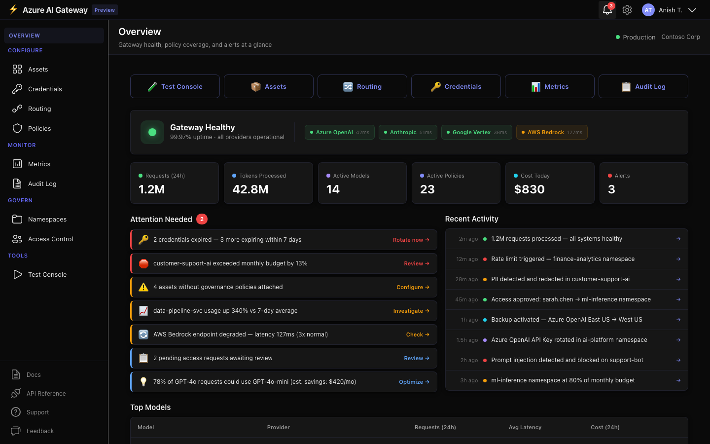
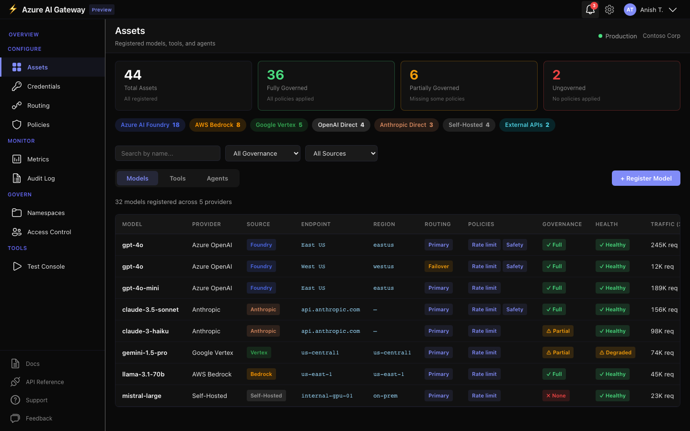
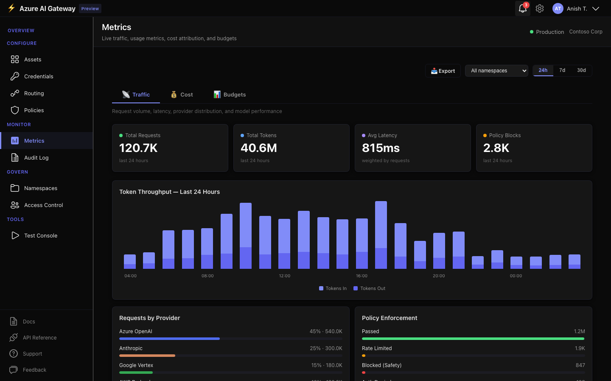
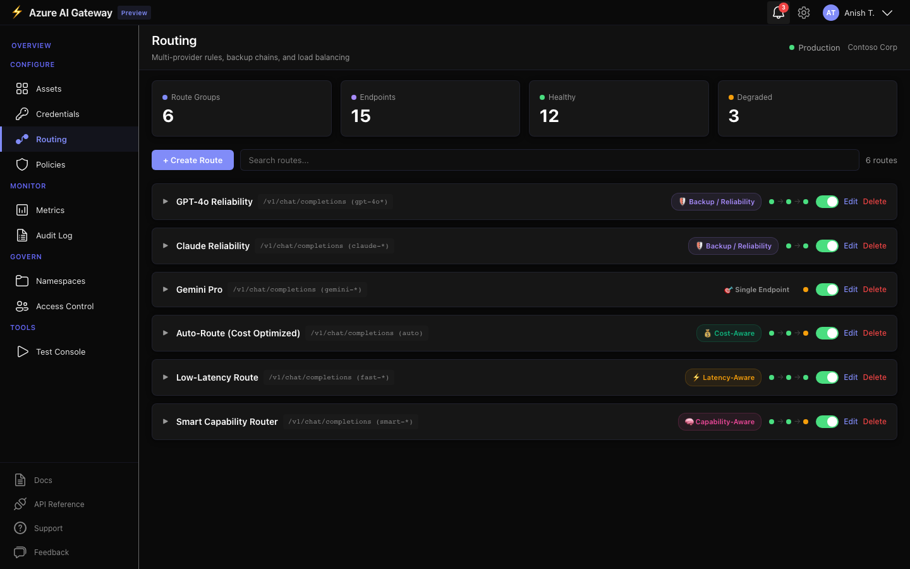
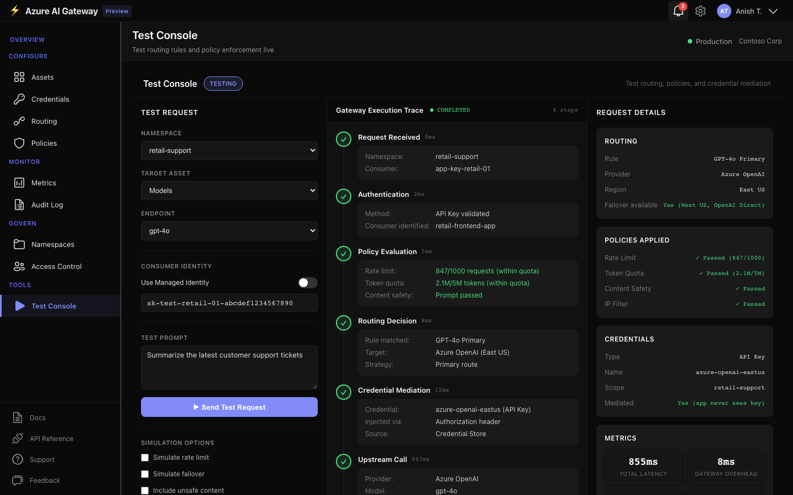

# Azure AI Gateway — Control Plane

## Overview

The governance-first portal for managing AI traffic across providers in production environments. A single pane of glass over every model, tool, and agent — whether running on Azure AI Foundry, AWS Bedrock, Google Vertex, OpenAI, Anthropic, or self-hosted infrastructure.

> **Configure. Monitor. Govern.** — The operations layer for AI workloads at enterprise scale.

## Portal

<p align="center">
  
</p>

<table>
  <tr>
    <td width="50%"></td>
    <td width="50%"></td>
  </tr>
  <tr>
    <td align="center"><strong>Assets</strong> — Multi-provider models, tools, and agents</td>
    <td align="center"><strong>Metrics</strong> — Traffic, cost attribution, and budget tracking</td>
  </tr>
  <tr>
    <td width="50%"></td>
    <td width="50%"></td>
  </tr>
  <tr>
    <td align="center"><strong>Routing</strong> — Multi-provider rules and failover chains</td>
    <td align="center"><strong>Test Console</strong> — Test routing and policy enforcement live</td>
  </tr>
</table>

---

**Key differentiators:**

- **AI-Native Asset Model** — models, tools, agents, and MCP servers are first-class platform objects, not just API proxies
- **Namespace-Based Governance** — namespaces are the primary governance boundary, grouping assets, policies, credentials, and budgets
- **Built-In Tool Governance** — tool catalogs, allowlists, invocation rate limits, credential management, and execution auditing
- **Enterprise Identity & Credentials** — JWT validation, Entra ID, managed identity, namespace-scoped credentials with blast radius analysis
- **Safety & Compliance Controls** — PII detection, harmful content blocking, prompt injection detection, tool action guardrails
- **Advanced Routing & Resilience** — cross-region, multi-provider, PTU→PAYGO fallback, cost-aware and capability-aware routing
- **Full AI Workload Observability** — traffic stats, cost attribution, budget tracking, chargeback reports, and anomaly detection
- **Cloud-Agnostic** — works with Azure OpenAI, OpenAI, Anthropic, Google Gemini, AWS Bedrock, and custom models

## Why a Control Plane?

Unlike LiteLLM and Portkey which focus primarily on model routing and observability, or Kong and Cloudflare which extend traditional API gateways for LLM traffic, Azure AI Gateway provides a complete **governance control plane** for AI workloads — supporting agentic applications, tool governance, namespace-based access control, and enterprise-grade safety enforcement.

The gateway is designed as the **operations layer** for AI — complementary to development platforms like Azure AI Foundry, not a replacement. Foundry is where you build AI. The Gateway is where you operate it.

## Relationship to Azure AI Foundry

| Concern | Foundry | AI Gateway |
|---|---|---|
| Build & train models | ✓ | — |
| Build agents & workflows | ✓ | — |
| Route AI traffic cross-cloud | — | ✓ |
| Multi-tenant namespace governance | — | ✓ |
| Token quotas & cost attribution | Basic | ✓ |
| Tool traffic governance | — | ✓ |
| Credential mediation | — | ✓ |
| Content safety at boundary | Basic | ✓ |
| Cross-platform observability | Per-model | ✓ |

**Foundry builds AI. The Gateway operates AI.** Use both together, or use the Gateway standalone with any AI platform.

## Two Portal Experiences

This repository contains the **AI Gateway Control Plane** portal. For the full-featured studio experience, see the parent repository:

### AI Gateway Control Plane (this repo)
The governance-first portal for **platform engineers, operations teams, and security teams**. Focused on configuration, monitoring, governance, and compliance. Modern black + soft indigo design.

### AI Gateway Studio → [**standalone-ai-gateway**](https://github.com/anishta_microsoft/standalone-ai-gateway)
The developer-facing portal with asset catalogs, interactive playground, and full model/tool/agent management. Best for standalone deployments and multi-cloud teams.

## Target Users

### Platform Engineers / Admins
- Define namespaces, policies, and credential scopes to govern AI workloads at scale
- Configure multi-provider routing, failover strategies, and cost controls across teams
- Monitor token usage, cost attribution, and budget burn rates through unified observability

### AI Developers / Agent Builders
- Discover approved models, tools, and skills through governed asset catalogs
- Register assets from any provider via guided wizards
- Test routing rules and policy enforcement in the live Test Console

### Security / Compliance Officers
- Audit all AI traffic through the complete request/response audit trail
- Review access controls, credential blast radius, and policy enforcement
- Monitor namespace-level budget rules and governance alerts

---

## Console Navigation

After login the sidebar is organized into four sections:

### Configure
| Page | Path | Description |
|------|------|-------------|
| **Assets** | `/assets` | Registered models, tools, and agents with governance status |
| **Credentials** | `/credentials` | API keys, managed identities, blast radius, and rotation |
| **Routing** | `/routing` | Multi-provider rules, failover chains, and load balancing |
| **Policies** | `/policies` | Runtime rules, access rules, safety guardrails, AI compose |

### Monitor
| Page | Path | Description |
|------|------|-------------|
| **Metrics** | `/observability` | Traffic · Cost · Budgets (3 tabs) |
| **Audit Log** | `/logs` | Complete request and response audit trail |

### Govern
| Page | Path | Description |
|------|------|-------------|
| **Namespaces** | `/namespaces` | Team boundaries, quotas, budget rules, and isolation policies |
| **Access Control** | `/access` | Users, service identities, API keys, and access requests |

### Tools
| Page | Path | Description |
|------|------|-------------|
| **Test Console** | `/test-console` | Test routing rules and policy enforcement live |

---

## Public Pages

Before authentication, visitors see marketing and onboarding pages:

| Page | Path | Description |
|------|------|-------------|
| **Landing** | `/` | Hero, architecture diagram, feature highlights, live stats |
| **Pricing** | `/pricing` | 3-tier SaaS — Developer (free), Pro ($99/mo), Enterprise (custom) |
| **Docs** | `/docs` | Documentation hub with search, quickstart cards, and code examples |
| **Demo** | `/demo` | Interactive guided walkthrough with 4 animated scenarios |

---

## Core Capabilities

### Overview Dashboard
Developer-first landing page with Quick Start shortcuts, gateway health hero, six key metrics, attention-needed alerts, recent activity feed, and top models table.

### Policy Lifecycle
Create policies via templates, forms, or **AI-powered natural language composition**. Version history, impact simulator, staged rollout, and full audit trail for every change.

### Cost Governance
Namespace-level budget rules with configurable scope (namespace, team, model), spend thresholds, enforcement actions (notify, throttle, block), and alert triggers. Budget monitoring in Metrics with burn rate tracking and anomaly detection.

### Credential Management
Full credential lifecycle with blast radius visualization showing dependent assets, routes, and namespaces. Rotation alerts, emergency revocation, and namespace-scoped assignment.

### Metrics & Observability
Three-tab analytics:
- **Traffic** — Request stats, token throughput, provider distribution, policy enforcement, model performance
- **Cost** — Spend analysis, cost-by-model, anomaly detection, chargeback reports with export
- **Budgets** — Allocation tracking, burn rates, inline editing, status badges, alerts

### Registration Wizards
Three six-step wizards for onboarding assets: **Source → Endpoint → Configuration → Governance → Namespace → Review**

| Wizard | Sources |
|--------|---------|
| **Register Model** | Azure AI Foundry (auto-discover), AWS Bedrock, Google Vertex, OpenAI, Anthropic, Self-Hosted |
| **Register Tool** | MCP Servers, REST APIs, SaaS Connectors |
| **Register Agent** | Foundry Agent Service, AWS Bedrock Agents, Google Vertex AI Agents, A2A Protocol, Custom Endpoints |

---

## Design Language

| Token | Value | Usage |
|-------|-------|-------|
| Background | `#0A0A0A` / `#161616` | Page and card surfaces |
| Indigo accent | `#818CF8` | Primary actions, active states, highlights |
| Indigo bright | `#A5B4FC` | Hover states |
| Indigo dim | `#6366F1` | Subtle accents |
| Borders | `rgba(129, 140, 248, 0.12)` | Card and section dividers |
| Text | `#E8E8E8` | Primary content |
| Green | `#4ADE80` | Success, healthy, active |
| Red | `#EF4444` | Error, danger, critical |
| Amber | `#F59E0B` | Warning, expiring |

Cards use raised surfaces with `box-shadow: 0 2px 8px rgba(0,0,0,0.35)`. Buttons are indigo background with white text across all pages.

---

## Tech Stack

- **React 19** + TypeScript
- **Vite 7** bundler
- **React Router 7** client-side routing
- **Fluent UI v9** (icons only)
- Inline `CSSProperties` dark theme (no external CSS framework)
- Centralized design tokens in `src/theme.ts`

## Getting Started

### Prerequisites

- Node.js 20+
- npm 9+

### Development

```bash
git clone https://github.com/anishta_microsoft/ai-gateway-control-plane.git
cd ai-gateway-control-plane
npm install
npm run dev          # http://localhost:5173
```

### Production Build

```bash
npm run build        # Output in /dist
```

### Deploy to Vercel

The repo includes `vercel.json` for SPA routing.

---

## Project Structure

```
src/
  components/       # Shared components (Layout, ConnectFoundryPanel, InlineCredentialForm)
  pages/            # All page components
    GovernanceDashboard.tsx   # Overview — developer-first landing
    Assets.tsx                # Asset catalog (models, tools, agents)
    Credentials.tsx           # Credential management + blast radius
    Routing.tsx               # Multi-provider routing rules
    Policies.tsx              # Runtime rules, access rules, AI compose
    Observability.tsx         # Metrics (Traffic / Cost / Budgets tabs)
    Logs.tsx                  # Audit log
    Namespaces.tsx            # Namespace governance + budget rules
    Access.tsx                # Access control
    TestConsole.tsx           # Live testing console
    RegisterModel.tsx         # 6-step model registration wizard
    RegisterTool.tsx          # 6-step tool registration wizard
    RegisterAgent.tsx         # 6-step agent registration wizard
    LandingPage.tsx           # Public landing page
    PricingPage.tsx           # Public pricing page
    DocsPage.tsx              # Public docs page
    DemoPage.tsx              # Public demo page
  theme.ts          # Centralized design tokens, colors, and shared styles
  App.tsx           # Router configuration
  main.tsx          # Entry point
```

---

## Documentation

| Document | Description |
|----------|-------------|
| [Product Vision](docs/product-vision.md) | Strategic context, target customers, guiding principles |
| [Architecture](docs/architecture.md) | System architecture, components, data flow |
| [Scenarios](docs/scenarios.md) | Full scenario matrix with build status |
| [Competitive Analysis](docs/competitive-analysis.md) | Market landscape and differentiation |
| [MVP Scope](docs/mvp-scope.md) | Phase 1 deliverables and success criteria |
| [Entity Model](docs/entity-model.md) | First-class asset types and relationships |
| [Governance](docs/governance.md) | Namespace-based governance model and policy enforcement |
| [User Flows](docs/user-flows.md) | End-to-end user journeys for all personas |
| [Credential Management](docs/credential-management.md) | Credential architecture, mediation, and security |
| [Positioning](docs/positioning.md) | Strategic differentiation and Foundry relationship |

## Related

- **[standalone-ai-gateway](https://github.com/anishta_microsoft/standalone-ai-gateway)** — AI Gateway Studio portal and runtime engine

## License

MIT
