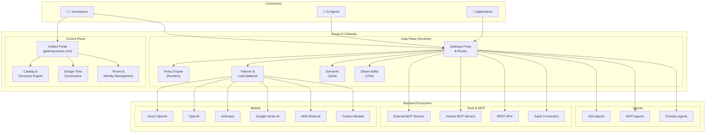
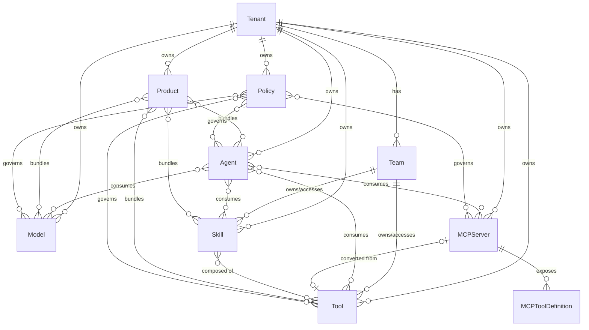
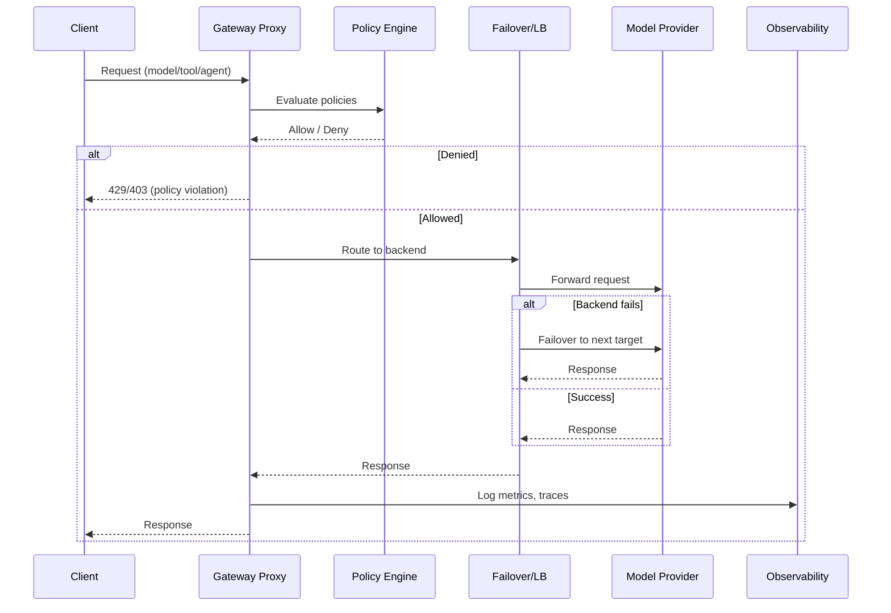

# Architecture — Azure AI Gateway

## High-Level Architecture

## Component Descriptions

### Control Plane
| Component | Responsibility |
|-----------|---------------|
| **Unified Portal** | Single UI for all gateway operations — discover, register, configure, monitor |
| **Catalog & Discovery** | Asset registry for models, tools, MCP servers, skills, agents. Search, filter, team visibility |
| **Design-Time Governance** | Schema validation, registration policies, approval workflows |
| **Tenant & Identity** | Multi-tenant isolation, RBAC, API key management, team structures |

### Data Plane (Runtime)
| Component | Responsibility |
|-----------|---------------|
| **Gateway Proxy & Router** | Request mediation, protocol translation, model routing |
| **Policy Engine** | Runtime policy evaluation — rate limits, token quotas, access control, IP filtering |
| **Failover & Load Balancer** | Automatic failover across deployments and providers, traffic splitting |
| **Semantic Cache** | Cache responses for semantically similar prompts to reduce cost |
| **Observability** | OpenTelemetry logs, traces, metrics — per-user token tracking, prompt logging |

## Multi-Tenant Data Model

## Request Flow

