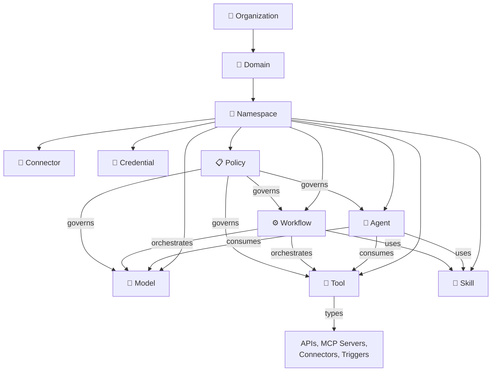
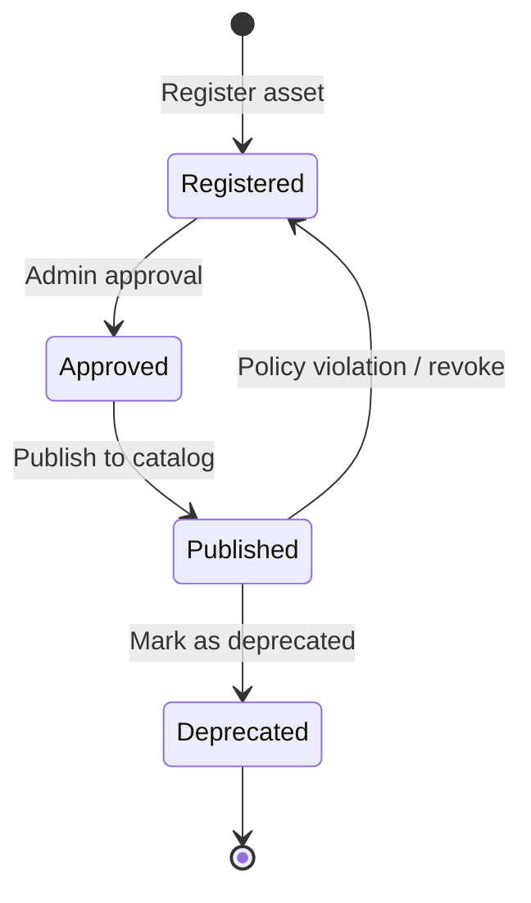

# Entity Model — AI Gateway

## Governance Hierarchy

```
Organization
   ↓
Domain (optional grouping by business unit)
   ↓
Namespace   ← primary governance boundary
   ↓
Assets (Models, Tools, Agents, Skills, Workflows, Connectors, Credentials)
```

## First-Class Entities



## Entity Definitions

### Organization

The top-level boundary. One organization per AI Gateway deployment.

- Contains domains (optional) and namespaces
- Defines global policies that cascade to all namespaces
- Manages platform-wide settings and admin roles

### Domain (optional)

Logical grouping by business unit.

- Groups related namespaces (e.g., "Retail AI", "Finance AI")
- No direct governance enforcement — purely organizational

### Namespace

The **primary governance boundary**. All assets, identities, policies, and observability data are scoped to a namespace.

- Groups AI assets
- Controls user and service identity access
- Defines runtime policies
- Manages credentials
- Supports multiple environments (sandbox, development, production)
- Types: `managed` (admin-created) or `personal` (developer-created)

### Model

A registered AI model endpoint from any provider.

- **Providers**: Azure OpenAI, OpenAI, Anthropic, Google Vertex AI, AWS Bedrock, custom
- **Capabilities**: chat, completion, embedding, image, audio, vision, function-calling
- **Governance**: namespace assignment, visibility level, token quotas, rate limits, routing rules, region restrictions
- **Failover**: ordered list of backup models (can cross providers and regions)

### Tool

An external capability that agents can invoke. Tools include multiple sub-types:

- **APIs**: REST, GraphQL, gRPC endpoints
- **MCP Servers**: Model Context Protocol endpoints (managed or external)
- **Connectors**: SaaS integrations (Salesforce, ServiceNow, etc.)
- **Triggers**: Event-driven invocation sources

**Governance**: namespace access, invocation limits, authentication credentials, network restrictions, audit logging.

### Agent

A reasoning system that orchestrates models and tools to accomplish tasks.

- **Protocol**: RAPI (request-response), A2A (agent-to-agent), custom
- Connected to models for reasoning
- Connected to tools for action
- Uses skills for composed capabilities
- **Governance**: allowed tools, allowed models, execution limits, namespace membership

### Skill

A reusable AI automation pattern combining models and tools.

- Types: prompt-chain, automation, analysis
- Has step pipeline with ordered execution
- Reusable across agents and workflows
- **Governance**: namespace visibility, execution permissions, tool access inheritance

### Workflow

A multi-step orchestration pattern.

- Combines models, tools, skills, and logic
- Types: orchestration, pipeline, event-driven
- Supports conditional branching and parallel execution
- **Governance**: namespace visibility, execution permissions

### Connector

An integration configuration used by tools.

- Links to external services (Salesforce, ServiceNow, SQL databases)
- **Governance**: credential scoping, namespace access, environment restrictions

### Credential

Secrets used for tool and connector access.

- Types: API keys, OAuth tokens, managed identities, Key Vault references
- **Governance**: namespace scope, rotation policies, restricted visibility, no direct exposure to agents

### Policy

A governance rule applied at design-time or runtime.

- **Categories**: Authentication, Credentials, Rate limits, Content safety, Routing/transformation, Agent execution
- **Attachment points**: Organization, Namespace, Asset, Agent
- Policies cascade downward through the hierarchy
- Composable — multiple policies can apply to the same asset

## Asset Visibility

Assets have visibility levels that control discoverability:

| Level | Description |
|-------|-------------|
| `private` | Only visible to the asset owner |
| `namespace` | Visible to all members of the namespace |
| `organization` | Visible across all namespaces in the organization |
| `public` | Visible to all (optional, for shared catalogs) |

## Asset Lifecycle

Assets follow a governed lifecycle:



| State | Description |
|-------|-------------|
| `registered` | Asset created, pending review |
| `approved` | Reviewed and approved, not yet in catalog |
| `published` | Live in the catalog, available for use |
| `deprecated` | Marked for removal, still functional |

## Access Control

Access is granted at three levels:

1. **Namespace** — default access boundary
2. **Asset** — fine-grained per-asset overrides
3. **Environment** — sandbox vs. production restrictions

### Roles

| Role | Scope | Permissions |
|------|-------|-------------|
| Platform Admin | Global | Manage namespaces, register assets, define policies, manage users |
| Namespace Admin | Namespace | Add users, import assets, configure policies, deploy workloads |
| AI Developer | Namespace | Use models, invoke tools, create agents, run workflows |
| Viewer | Namespace | View assets, view metrics, inspect executions |
| Service Identity | Runtime | Invoke models, run agents, call tools |

## Relationships Summary

| From | To | Relationship |
|------|----|-------------|
| Organization | Domain | has many |
| Domain | Namespace | has many |
| Namespace | All assets | owns |
| Namespace | User / Service Identity | grants access to |
| Namespace | Policy | defines |
| Tool | Sub-types (API, MCP, Connector, Trigger) | classified as |
| Skill | Tool, Model | composed of |
| Agent | Model | consumes |
| Agent | Tool | consumes |
| Agent | Skill | uses |
| Workflow | Model, Tool, Skill | orchestrates |
| Policy | Model, Tool, Agent, Workflow | governs |
